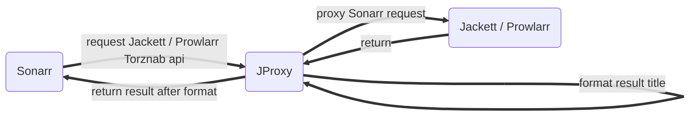

## PTtool

> Github: [appotry/PTtool](https://github.com/appotry/PTtool)
>
> 纯Bash Shell硬链接工具！支持所有Linux， BSD， Mac，**群辉**，**威联通**等支持标准Shell的操作系统！

---

## PT工具集合

- [硬链接工具](https://github.com/appotry/PTtool/) 自动硬链接工具
- [flexget-nexusphp](https://github.com/appotry/flexget-nexusphp), 自动下载刷流工具。Flexget插件，增强对NexusPHP的过滤
- [nas-tools](https://github.com/jxxghp/nas-tools) **新秀**，**国人**出的NAS媒体库资源自动搜刮整理工具，自动下载，刮削，支持PT刷流！中文支持较好。**注意**暂时功能不够完善，Bug较多，评价是试用，尝鲜，还不能胜任主力！
- [IYUUAutoReseed](https://github.com/appotry/IYUUAutoReseed) 自动辅种助手。**PT三剑客**
- [PTPP](https://github.com/appotry/PT-Plugin-Plus) 浏览器辅种助手。**PT三剑客**
- [pt_helper](https://hub.docker.com/r/crazyq/pt_helper), **非开源软件** 自动刷流与签到。**PT三剑客** [nas-tools](https://github.com/jxxghp/nas-tools)可以替代刷流
- [PT站生成海报墙](https://github.com/appotry/universal-torrent-gallery)
- [一键转种脚本](https://github.com/appotry/easy-upload) PT一键转种脚本（树大版）
- [PT自动签到 Github Action 版](https://github.com/appotry/PT_signin)
- [flexget qbittorrent删种、辅种 自动签到 插件](https://github.com/appotry/flexget_qbittorrent_mod)
- [自动发种机](https://github.com/dongshuyan/Auto_Upload) 全自动将本地资源发布到 PT 站并自动辅种  
- [自动将本地资源发布到PT站](https://github.com/dongshuyan/Upload_Machine) 看简介比 Auto_Upload 功能更强大
- [qBittorrent rss订阅规则管理](https://github.com/Nriver/qb-rss-manager)
- [Mkv Auto Subset](https://github.com/MkvAutoSubset/MkvAutoSubset) ASS字幕字体子集化 MKV批量提取/生成
- [jproxy](https://github.com/LuckyPuppy514/jproxy) 优化 Sonarr 对资源的识别率，主要是针对动漫
- [xarr-rss](https://xarr-doc.52nyg.com/xarr-rss/#/) 剧情Rss订阅处理器 目前非开源？
- [pter 猫站使用脚本集合](https://github.com/inerfire/pter_scripts)
- [auto-bangumi 基于Mikan Project的中文自动追番解决方案](https://github.com/EstrellaXD/Auto_Bangumi) 解决中文自动追番痛点
- [BangumiBot](https://github.com/RanKKI/BangumiBot) 类似auto-bangumi的工具，只是auto-bangumi支持Qbittorrent，BangumiBot支持Aria2/Tr


## 相关教程

- [视频图书和音乐完全自动化管理框架图解](https://blog.17lai.site/posts/db7bf49b/)
- [如何使用tinyMediaManager刮削电影和电视剧，动画，并自动下载字幕](https://blog.17lai.site/posts/e6d40157/)
- [使用jeckett,sonarr,iyuu,qt,emby打造全自动追剧流程](https://blog.17lai.site/posts/9912bd5d/)
> nastools目前看来还只是个玩具，各种功能bug较多，完成度大概只有Sonarr, Radarr的三分之一。要搭建一个稳定，可用的自动多媒体管理工具，还是需要使用Radarr, Sonarr，Nastools等1年再看

### 框架自动化构架图解

- 点击放大
[](https://cimg1.17lai.site/data/2022/05/09/20220509113832.webp)



jproxy 使用图解

## 硬链接工具

---

## 设计目的

方便PT用户硬链接文件，在最大可能情况下节约空间，并保持做种。
小于1M的文件直接复制，方便emby，tmm等工具刮削修改nfo等小文件。
大于1M的文件硬链接到目的目录，可以修改文件名，但是不能修改文件内容！

例如：
/share/Download/src #保存下载的PT文件
/share/Download/dst #保存你自己处理过的视频文件，把emby，tmm的目录设置到dst下面
下载脚本后chmod +x mklink.sh给与执行权限
使用mklink脚本修改如下，然后直接运行mklink.sh。就可以把src下面的文件全部硬链接到dst目录。mklink适合一次性把源文件夹链接到目的文件夹

```
SRC="/share/Download/src"
DST="/share/Download/dst"
```

注意：
>源目录，目的目录需要在一个硬盘分区里面。硬链接不能跨分区。
>
>硬链接过的文件可以使用mv来修改存储目录，不影响硬链接效果。但是cp会增加一份存储空间。所以对于已经硬链接过的文件，使用mv，不要使用cp。
>
## 解决的问题

tmm，emby刮削的时候，必定修改nfo文件，下载的封面等图片不同刮削站点都不同，所以小文件复制，不怕修改。大文件硬链接，占有一份空间
被硬链接过的文件，同时存在多个地方，但是都指向一个存储空间，只有所有的硬链接都删除了，这个文件才会被系统删除。
同时，所有的硬链接文件，修改其中一个，其它所有指向这个位置的硬链接文件都被修改了。

## 使用说明

下载资源目录/share/Download，qbittorrent资源分类下载到/share/Download/src/下面的各个子目录，例如tv, anime, tv, movie, 4k, soft等等
创建一个资源整理使用目录/share/Download/dst/目录，然后就可以把/share/Download/src和/share/Download/dst目录作为下面2个脚本的输入目录，来使用了

小文件直接复制，方便tmm刮削修改nfo文件，大文件硬链接，只占有一份空间，但有2分文件，可以改名，移动目录，方便tmm整理刮削。 做种，emby使用两不误！

### 建议目录结构

```
/share/Downlosd/src       # BT下载工具默认保存主目录
/share/Download/dst       # 硬链接目的目录，Emby，tmm，使用的目录，保存各种刮削信息。以及个人文件名修改，目录结构修改。
在src目录下面建立子目录movie,music,anime,tv,4k等等，在qbittorrent里面设置分类，
指向这里的movie,music,anime，tv等子目录。下载完后使用下面的硬链接脚本，
把文件硬链接到目的文件夹。tmm，emby使用目的文件夹刮削数据。
```

#### qbittorrent使用设置

- 移动种子保存位置
在qt的web界面种子上面右键，选择菜单保存位置
- 设置分类目录
在qt的web界面种子上面右键，选择分类->新分类，先写分类名称和路径。对于多文件种子，种子添加时选择自动管理。对于单文件种子，请自行添加子文件夹，或强制创建子文件夹。

## mklink.sh

修改脚本参数源目录，目的目录,替换为你自己的目录。
脚本将把源目录所有文件硬链接到目的目录，小于1M的文件直接复制到目的目录。方便nfo等小文件刮削修改，大于1M的文件
硬链接到目的目录，以节约空间，2份文件只占有一份空间。

mklink 直接针对2个文件夹做硬链接，小于1m的复制，但是没有判断是否已经硬链接过。**适合全新的没有硬链接过的目录**。

```bash
#mklink.sh sourcedir dstdir
mklink.sh /share/Download/tmp/src /share/Download/tmp/dst
```

## dirlink.sh
设计原理：针对输入原路径下一级子目录判断是否有文件islinked.lk，
有这个文件就跳过，没有就硬链接这个子目录到目的目录生成对应的子目录。
小于1M的文件复制，大于1M的文件硬链接。

可以直接修改脚本源目录，目的目录参数，也可以从参数$!,$2输入源目录，目的目录。
此脚本和mklink.sh区别在于，将检查每个目录是否已经被硬链接过，已经连接过的将跳过去不再硬链接。
原理是在源文件夹目录下添加文件islinked.lk，通过检测这个文件来判断是否硬链接过

```bash
SRC="/share/Download/tmp/src/movie"
DST="/share/Download/tmp/dst/movie"
```

注意：src目录下面的文件需要放到各个子目录下面去，例如src/anime/amine1,src/tv/tv2，这样才能保证islinked.lk工作正常
目录设置可以直接修改脚本，也可以命令行参数输入

```bash
#dirlink.sh sourcedir dstdir
dirlink.sh /share/Download/tmp/src /share/Download/tmp/dst
```

### 重新建立连接，一次性删除所有islinked.lk文件

```bash
find /share/Download/tmp -name "islinked.lk" | xargs rm -f
```

替换前面的路径/share/Download/tmp为你自己的路径，操作和rm相关的命令一定**注意不要输入错误**，删错文件代价极大！

### 一次性硬链接多个目录

如下所示脚本link.sh

```bash
#!/bin/sh
/share/Download/source/dirlink.sh /share/Download/source/anime /share/Download/dst/anime
/share/Download/source/dirlink.sh /share/Download/source/movie /share/Download/dst/movie
/share/Download/source/dirlink.sh /share/Download/source/tv /share/Download/dst/tv
```

## 修改限制2M大小以下的复制

修改脚本参数FILEGIG，原脚本是1M大小，修改为下面这样就是2M大小

```bash
FILEGIG=2000000c
```

## autolink.sh

qBittorrent 下载完成时自动硬链接下载完的种子，适用于新下载完成的种子文件。以前下载完成的文件建议使用`link.sh`脚本的方法。
注意：脚本会判断是否进行硬链接的分类，分类详情见脚本内容。
- 修改脚本目标目录
将你的目录填在```your_path```的等号后。
- 设置下载完成后自动运行
在qt的web界面g，点击工具->选项->下载，勾选“Torrent 完成时运行外部程序”，填入`/path/to/autolink.sh "%N" "%D" "%L"`
注意：填入autolink.sh的绝对位置，同时autolink与dirlink须在同一目录

这个脚本使用，需要手动修改脚本中的分类，下面这一行！

```bash
if [[ "$torrent_category" == *"movies"* || "$torrent_category" == *"series"* || "$torrent_category" == *"documents"* || "$torrent_category" == *"operas"* ]]
```

$torrent_category 是qBittorrent分类名称，也是目录名称！

## 注意事项

- 注意Linux权限，如果运行出错，请检查所使用的的用户和用户组权限。目的目录是否可写！

## 使用声明

数据无价，小心操作。
本脚本（除autolink.sh外）没有rm删除，只有mkdir和cp， 最多搞乱文件系统。但要注意不要把目的地目录设置到系统目录去了。
一切后果自负

## 感觉对你有帮助，来个star吧

## Contributing

1. Fork it ( https://github.com/appotry/PTtool/fork )
2. Create your feature branch (`git checkout -b my-new-feature`)
3. Commit your changes (`git commit -am 'Add some feature'`)
4. Push to the branch (`git push origin my-new-feature`)
5. Create a new Pull Request

