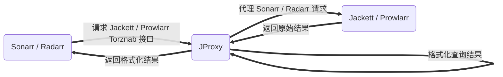

# PTtool

> GitHub: [appotry/PTtool](https://github.com/appotry/PTtool)
>
> 纯 Shell / Python 硬链接工具！支持 Linux、BSD、Mac、**群辉**、**威联通**等支持标准 Shell 的操作系统。
>
> **[English](README.en.md)** · **[日本語](README.ja.md)**
>
> [](https://opencode.ai)
> [](https://github.com/appotry/PTtool/actions/workflows/test.yml)

---

本项目采用 [opencode](https://opencode.ai) 全程重构，实现 **AI Agent 驱动的开发-测试闭环**：需求→架构→编码→Docker 测试→经验入库，全部由 Agent 自主完成。详见 [`AGENTS.md`](AGENTS.md) 和 [`docs/`](docs/)。

---

## 目录

- [PT 工具集合](#pt-工具集合)
- [相关教程](#相关教程)
- [语言切换](#语言切换)
- [硬链接工具](#硬链接工具)
- [设计目的](#设计目的)
- [解决的问题](#解决的问题)
- [使用说明](#使用说明)
- [mklink.sh](#mklinksh)
- [dirlink.sh](#dirlinksh)
- [修改限制 2M 大小以下的复制](#修改限制-2m-大小以下的复制)
- [autolink.sh](#autolinksh)
- [注意事项](#注意事项)
- [使用声明](#使用声明)
- [Contributing](#contributing)

---

## PT 工具集合

- [硬链接工具](https://github.com/appotry/PTtool/) — 自动硬链接工具
- [flexget-nexusphp](https://github.com/appotry/flexget-nexusphp) — 自动下载刷流工具，Flexget 插件，增强对 NexusPHP 的过滤
- [nas-tools](https://github.com/nastool/nas-tools)（[源码备份](https://github.com/wangyan/nas-tools)）— **已经停止开发！** 功能不够完善，Bug 较多，还在试用阶段，还不能胜任主力。后续 Bug 得不到修正，强烈建议切换到 Sonarr、Radarr、Flexget
- [MoviePilot](https://github.com/jxxghp/MoviePilot) — nas-tools 作者重构项目，**核心闭源**。提升了速度，但功能和稳定性方面还需提升
- [vertex](https://github.com/vertex-app/vertex) — 追剧刷流一体化综合管理工具，[使用说明 Wiki](https://wiki.vertex.icu/zh/home)
- [PTools](https://github.com/ngfchl/ptools) — 自动签到、种子推送工具
- [pt-tools](https://github.com/sunerpy/pt-tools) — 刷流神器，多站点 + 多下载器 + 免费种子
- [IYUUAutoReseed](https://github.com/appotry/IYUUAutoReseed) — 自动辅种助手，**PT 三剑客**
- [PTPP](https://github.com/appotry/PT-Plugin-Plus) — 浏览器辅种助手，**PT 三剑客**
- [pt_helper](https://hub.docker.com/r/crazyq/pt_helper) — **非开源**，自动刷流与签到，**PT 三剑客**
- [PT 站生成海报墙](https://github.com/appotry/universal-torrent-gallery)
- [一键转种脚本](https://github.com/appotry/easy-upload) — PT 一键转种（树大版）
- [PT_signin](https://github.com/appotry/PT_signin) — PT 自动签到，GitHub Action 版
- [flexget qbittorrent 删种、辅种 自动签到 插件](https://github.com/appotry/flexget_qbittorrent_mod)
- [Auto_Upload](https://github.com/dongshuyan/Auto_Upload) — 全自动发布资源到 PT 站并自动辅种，[使用教程](https://pypi.org/project/auto-upload/)
- [Upload_Machine](https://github.com/dongshuyan/Upload_Machine) — 自动发布资源到 PT 站，功能比 Auto_Upload 更强大
- [qBittorrent RSS 订阅规则管理](https://github.com/Nriver/qb-rss-manager)
- [Mkv Auto Subset](https://github.com/MkvAutoSubset/MkvAutoSubset) — ASS 字幕字体子集化，MKV 批量提取/生成
- [jproxy](https://github.com/LuckyPuppy514/jproxy) — 优化 Sonarr 对资源的识别率，主要针对动漫
- [xarr-rss](https://xarr-doc.52nyg.com/xarr-rss/#/) — 剧情 RSS 订阅处理器
- [pter 猫站脚本集合](https://github.com/inerfire/pter_scripts)
- [auto-bangumi](https://github.com/EstrellaXD/Auto_Bangumi) — 基于 Mikan Project 的中文自动追番方案
- [BangumiBot](https://github.com/RanKKI/BangumiBot) — 类似 auto-bangumi，支持 Aria2/Tr
- [embyExternalUrl](https://github.com/bpking1/embyExternalUrl) — Emby 调用外部播放器，使用本地解码
- [subtitle-translator-electron](https://github.com/gnehs/subtitle-translator-electron) — 用 ChatGPT 翻译字幕
- [ani-rss](https://github.com/wushuo894/ani-rss) — **日番追番神器**，推荐，解决了不少 AutoBangumi 的痛点
- [bgmi](https://github.com/codysk/bgmi-docker-all-in-one) — 又一个**日番追番神器**
- [pt_mate](https://github.com/JustLookAtNow/pt_mate/) — 基于 Flutter（Material Design 3）的 PT 站点客户端，支持 M-Team 和 NexusPHP

## 相关教程

- [从零开始玩 PT — 入门到精通](https://blog.17lai.site/posts/9806d7f1/)
- [如何建立自己的私人电子图书馆（出版书籍、网络小说、漫画一网打尽）](https://blog.17lai.site/posts/dc1c8194/)
- [视频、图书和音乐完全自动化管理框架图解](https://blog.17lai.site/posts/db7bf49b/)
- [如何使用 tinyMediaManager 刮削电影、电视剧、动画，并自动下载字幕](https://blog.17lai.site/posts/e6d40157/)
- [使用 Jackett、Sonarr、IYUU、qB、Emby 打造全自动追剧流程](https://blog.17lai.site/posts/9912bd5d/)
- [qBittorrent 参数详细设置教程](https://blog.17lai.site/posts/f6b32521/)
- [Transmission 使用及其配置](https://blog.17lai.site/posts/8f76d9dd/)
- [PotPlayer 终极优化教程，实现 PC 视频播放最强画质](https://blog.17lai.site/posts/2f8fb473/)

### 框架自动化构架图解

点击放大：
[](https://cimg1.17lai.site/data/2022/05/09/20220509113832.webp)


```mermaid
graph LR
    1[Sonarr / Radarr] == 请求 Jackett / Prowlarr Torznab 接口 ==> 2(JProxy) == 代理 Sonarr / Radarr 请求 ==> 3(Jackett / Prowlarr)

    3(Jackett / Prowlarr) == 返回原始结果 ==> 2(JProxy) == 返回格式化结果 ==> 1(Sonarr / Radarr)

    2(JProxy) == 优化查询关键字 ==> 2(JProxy)
    2(JProxy) == 格式化查询结果 ==> 2(JProxy)
```

*jproxy 使用图解*

## 语言切换

脚本输出语言由环境变量 `SCRIPT_LANG` 控制，默认跟随系统 `LANG`：

```bash
# 英文输出
SCRIPT_LANG=en_US ./dirlink.sh /src /dst

# 中文输出（默认）
./dirlink.sh /src /dst
```

`rename_episodes.py` 同样支持 `SCRIPT_LANG` 环境变量。

## 硬链接工具

---

## 设计目的

方便 PT 用户硬链接文件，在最大可能情况下节约空间，并保持做种。
小于 1MB 的文件直接复制，方便 Emby、tmm 等工具刮削修改 nfo 等小文件。
大于 1MB 的文件硬链接到目的目录，可以修改文件名，但不能修改文件内容！

例如：

```
/share/Download/src — 保存下载的 PT 文件
/share/Download/dst — 保存你处理过的视频文件，把 Emby、tmm 的目录设置到 dst 下面
```

下载脚本后 `chmod +x mklink.sh` 给与执行权限。设置 SRC 和 DST 后直接运行，即可把 src 下面的文件全部硬链接到 dst 目录。`mklink.sh` 适合一次性把源文件夹链接到目的文件夹。

```bash
SRC="/share/Download/src"
DST="/share/Download/dst"
```

**注意：**

> 源目录、目的目录需要在同一个硬盘分区里面——硬链接不能跨分区。
>
> 硬链接过的文件可以使用 `mv` 来修改存储目录，不影响硬链接效果；但 `cp` 会增加一份存储空间。所以对于已经硬链接过的文件，使用 `mv`，不要使用 `cp`。

## 解决的问题

tmm、Emby 刮削的时候，必定修改 nfo 文件；下载的封面等图片不同刮削站点也各不相同。所以小文件复制，不怕修改；大文件硬链接，只占一份空间。

被硬链接过的文件同时存在多个地方，但都指向同一个存储空间。只有所有的硬链接都被删除了，这个文件才会被系统真正删除。同时，所有硬链接文件共享数据——修改其中一个，其他所有指向这个位置的硬链接文件都会被修改。

## 使用说明

下载资源目录 `/share/Download`，qBittorrent 资源分类下载到 `/share/Download/src/` 下面的各个子目录，例如 tv、anime、movie、4k、soft 等。
创建一个资源整理目录 `/share/Download/dst/`，然后把 `/share/Download/src` 和 `/share/Download/dst` 作为脚本的输入目录来使用。

小文件直接复制，方便 tmm 刮削修改 nfo 文件；大文件硬链接，只占一份空间，但有 2 份文件入口，可以改名、移动目录，方便 tmm 整理刮削。做种和 Emby 使用两不误！

### 建议目录结构

```
/share/Download/src       # BT 下载工具默认保存主目录
/share/Download/dst       # 硬链接目的目录，Emby、tmm 使用
```

在 src 目录下面建立子目录（movie、music、anime、tv、4k 等），在 qBittorrent 中设置分类指向这些子目录。下载完成后使用硬链接脚本，把文件链接到目的文件夹。tmm、Emby 使用目的文件夹刮削数据。

#### qBittorrent 使用设置

- **移动种子保存位置**：在 qBittorrent Web 界面种子上面右键 → 选择菜单"保存位置"
- **设置分类目录**：右键 → 分类 → 新分类，填写分类名称和路径。对于多文件种子，添加时选择自动管理；对于单文件种子，请自行添加子文件夹，或强制创建子文件夹

## mklink.sh

修改脚本参数中的源目录和目标目录，替换为你自己的目录。
脚本将把源目录中所有大于 1MB 的文件硬链接到目的目录，小于 1MB 的文件直接复制到目的目录（方便 nfo 等小文件被刮削修改）。

`mklink.sh` 直接针对两个文件夹做操作，**不做幂等检查**。适合全新的、没有硬链接过的目录。

```bash
# mklink.sh sourcedir dstdir
mklink.sh /share/Download/tmp/src /share/Download/tmp/dst
```

## dirlink.sh

设计原理：对源目录下的每个子目录，检查是否存在 `islinked.lk` 标记文件。有此文件则跳过，没有则硬链接该子目录到目的目录，并创建标记文件。
小于 1MB 的文件复制，大于 1MB 的文件硬链接。

可以直接在脚本中修改源目录和目标目录，也可以通过命令行参数 `$1`、`$2` 传入。

```bash
SRC="/share/Download/tmp/src/movie"
DST="/share/Download/tmp/dst/movie"
```

**注意：** 源目录下面的文件需要放到各个子目录下（例如 `src/anime/anime1`、`src/tv/tv2`），这样才能保证 `islinked.lk` 正常工作。

```bash
# dirlink.sh sourcedir dstdir
dirlink.sh /share/Download/tmp/src /share/Download/tmp/dst
```

### 重新建立连接：一次性删除所有 islinked.lk 文件

```bash
find /share/Download/tmp -name "islinked.lk" | xargs rm -f
```

替换前面路径 `/share/Download/tmp` 为你自己的路径。操作和 `rm` 相关的命令一定**注意不要输入错误**，删错文件代价极大！

### 一次性硬链接多个目录

示例如下（`link.sh`）：

```bash
#!/bin/sh
/path/to/dirlink.sh /share/Download/src/anime /share/Download/dst/anime
/path/to/dirlink.sh /share/Download/src/movie /share/Download/dst/movie
/path/to/dirlink.sh /share/Download/src/tv   /share/Download/dst/tv
```

## 修改限制 2MB 大小以下的复制

修改脚本参数 `FILEGIG`。原脚本默认 1MB，修改为下面这样就是 2MB：

```bash
FILEGIG=2000000c
```

`1000000c` 表示 1,000,000 字节，也就是 1MB。在 `find` 命令的 `-size` 选项中，`c` 表示字节，`k` 表示千字节，`M` 表示兆字节，`G` 表示吉字节。

字节换算关系：

- 1 字节（Byte）= 8 比特（Bit）
- 1 KB = 1024 字节
- 1 MB = 1024 KB
- 1 GB = 1024 MB

例如：

```bash
FILEGIG=10M    # 10MB 以下复制，以上硬链接
FILEGIG=100M   # 100MB
```

## autolink.sh

qBittorrent 下载完成时自动硬链接该种子，适用于新下载完成的种子。以前下载完成的文件建议使用 `link.sh`。

- **修改目标目录**：编辑脚本中的 `your_path` 变量
- **设置下载完成后自动运行**：在 qBittorrent Web 界面 → 工具 → 选项 → 下载 → 勾选"Torrent 完成时运行外部程序"，填入：

```
/path/to/autolink.sh "%N" "%D" "%L"
```

> `autolink.sh` 和 `dirlink.sh` 必须在同一目录。

**默认自动适配所有分类**，无需手动修改脚本中的分类列表。如需排除某些分类，编辑脚本中 `EXCLUDE_CATEGORIES` 变量即可。

`$torrent_category` 是 qBittorrent 分类名称，也是目录名称。

## 注意事项

- 注意 Linux 权限。如果运行出错，请检查所使用的的用户和用户组权限，目的目录是否可写！

## 使用声明

数据无价，小心操作。
本脚本（除 `autolink.sh` 外）没有 `rm` 删除操作，只有 `mkdir` 和 `cp`，最多搞乱文件系统。但注意不要把目的地目录设置到系统目录去了。
一切后果自负。

## 感觉对你有帮助，来个 star 吧 ⭐

## Contributing

1. Fork 本仓库（https://github.com/appotry/PTtool/fork）
2. 创建你的特性分支（`git checkout -b my-new-feature`）
3. 提交你的修改（`git commit -am 'Add some feature'`）
4. 推送分支（`git push origin my-new-feature`）
5. 创建一个 Pull Request
